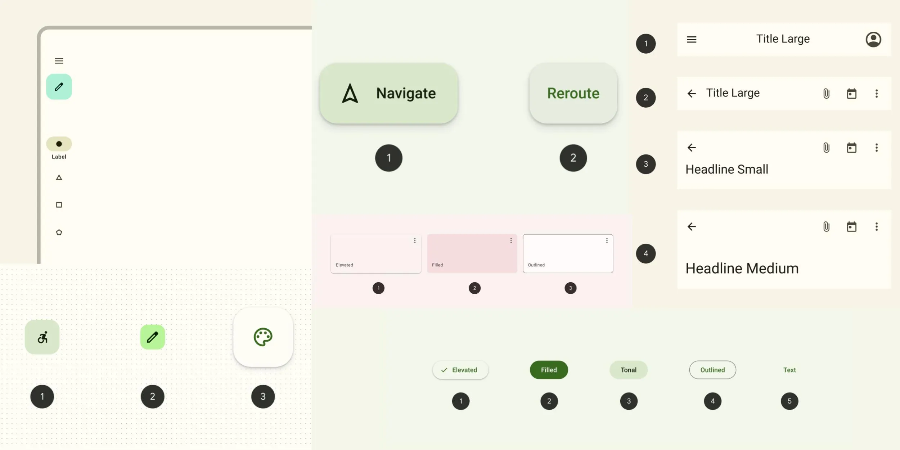
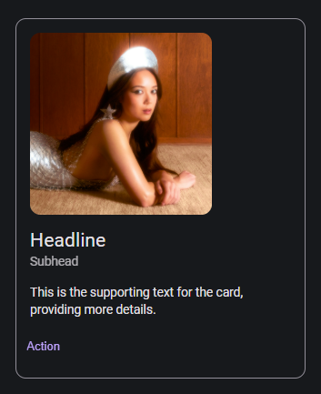
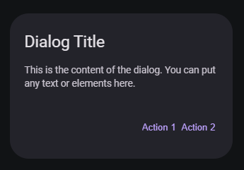
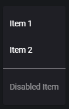
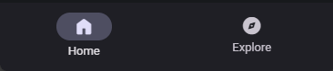

# Material Design 3



## Overview

A lightweight, dependency-free CSS and JavaScript framework for implementing Google's Material Design 3 on the web. `md3` provides a comprehensive set of styled components and a powerful dynamic theming engine, allowing you to create beautiful, modern user interfaces with ease.

The core feature is a "Monet"-style theming engine that generates a complete Material You color palette from a single seed color, which can be extracted directly from an image.

## Features

-   **Dynamic Theming**: Automatically generate a full color scheme from a primary color or an image, just like Android's Material You.
-   **Light & Dark Mode**: Seamlessly switch between light and dark themes. The framework defaults to the user's system preference.
-   **Comprehensive Component Library**: Includes a wide range of pre-styled and interactive Material Design 3 components.
-   **Pure CSS & JS**: Built with vanilla CSS and JavaScript for maximum performance and compatibility.
-   **Responsive Design**: Components like navigation bars, drawers, and menus are fully responsive and adapt to different screen sizes.

## Getting Started

### 1. Include the Files

To use the dynamic theming capabilities, you must include the `chroma.js` and `vibrant.js` libraries. Then, add the `md3` stylesheets and scripts to your project.

Place the CSS links in your `<head>` tag and the script tags just before the closing `</body>` tag.

```html
<!DOCTYPE html>
<html lang="en">
<head>
    <meta charset="UTF-8">
    <meta name="viewport" content="width=device-width, initial-scale=1.0">
    <title>My MD3 Project</title>

    <!-- MD3 Styles -->
    <link rel="stylesheet" href="styles/styles.css">
    <link rel="stylesheet" href="styles/components.css">

    <!-- Optional: Google Material Symbols -->
    <link rel="stylesheet" href="https://fonts.googleapis.com/css2?family=Material+Symbols+Rounded:opsz,wght,FILL,GRAD@20..48,100..700,0..1,-50..200" />
</head>
<body>
    <!-- Your content here -->


    <!-- Dependencies for monet.js -->
    <script src="https://cdnjs.cloudflare.com/ajax/libs/chroma-js/2.4.2/chroma.min.js"></script>
    <script src="https://cdnjs.cloudflare.com/ajax/libs/vibrant.js/1.0.0/Vibrant.min.js"></script>

    <!-- MD3 Scripts -->
    <script src="script/monet.js"></script>
    <script src="script/material-you.js"></script>

    <!-- Your custom script to initialize the theme -->
    <script>
      // Example: Initialize theme with a hex color
      colorScheme('#6750A4');

      // Example: Add a button to toggle dark mode
      // <button onclick="toggleDarkMode()">Toggle Dark Mode</button>
    </script>
</body>
</html>
```

### 2. Dynamic Theming

Use the functions from `script/monet.js` to apply a dynamic theme.

-   **From a Hex Color:** Call `colorScheme()` with your primary color.

    ```javascript
    // Set theme based on the color purple
    colorScheme('#6750A4');
    ```

-   **From an Image:** Call `colorSchemeImg()` with the path to your image. The script will extract the dominant colors and generate the theme.

    ```html
    
    ```
    ```javascript
    // Generate theme from the image
    colorSchemeImg(document.getElementById('theme-image').src);
    ```

-   **Toggle Dark Mode:** Use the `toggleDarkMode()` function to switch between light and dark themes.

    ```html
    <button class="md3-btn md3-btn--filled" onclick="toggleDarkMode()">Toggle Theme</button>
    ```

## Components

`md3` provides the HTML structure and CSS classes for a wide variety of Material components. The necessary JavaScript for interactive components is included in `material-you.js`.

| Component                 | Class/Element                |
| ------------------------- | ---------------------------- |
| **Buttons**               | `.md3-btn`                   |
| &nbsp;&nbsp;&nbsp;Elevated | `.md3-btn--elevated`         |
| &nbsp;&nbsp;&nbsp;Filled   | `.md3-btn--filled`           |
| &nbsp;&nbsp;&nbsp;Tonal    | `.md3-btn--filled-tonal`     |
| &nbsp;&nbsp;&nbsp;Outlined | `.md3-btn--outlined`         |
| &nbsp;&nbsp;&nbsp;Text     | `.md3-btn--text`             |
| &nbsp;&nbsp;&nbsp;Icon     | `.md3-btn--icon`             |
| **Floating Action Button** | `.md3-btn--fab`              |
| **Cards**                 | `.md3-card`                  |
| **Chips**                 | `.md3-chip`                  |
| **Dialogs**               | `<dialog class="md3-dialog">` |
| **Menus**                 | `.md3-menu`                  |
| **Navigation Bar**        | `.md3-nav`                   |
| **Navigation Drawer**     | `.md3-drawer`                |
| **Top App Bar**           | `.md3-topbar`                |
| **Snackbars**             | `.md3-snackbar`              |
| **Inputs**                | `.md3-input--*`              |
| **Tables**                | `.md3-table`                 |

### Usage Examples

#### Cards



```html
<div class="md3-card md3-card--outlined">
    
    <span class="md3-card__headline">Headline</span>
    <span class="md3-card__subhead">Subhead</span>
    <p class="md3-card__text">
        This is the supporting text for the card, providing more details.
    </p>
    <button class="md3-btn md3-btn--text md3-card__btn">Action</button>
</div>
```

#### Dialogs

Use the `openDialog('dialog-id')` function to open a dialog.



```html
<!-- Button to open the dialog -->
<button class="md3-btn md3-btn--filled" onclick="openDialog('my-dialog')">Open Dialog</button>

<!-- Dialog element -->
<dialog class="md3-dialog" id="my-dialog">
    <span class="md3-dialog__headline">Dialog Title</span>
    <p class="md3-dialog__text">
        This is the content of the dialog. You can put any text or elements here.
    </p>
    <div class="md3-dialog__btn">
        <button class="md3-btn md3-btn--text" onclick="closeDialog()">Action 1</button>
        <button class="md3-btn md3-btn--text" onclick="closeDialog()">Action 2</button>
    </div>
</dialog>
```

#### Menus

Attach a menu to a trigger element using the `click` or `contextmenu` attribute.



```html
<!-- Trigger button -->
<button class="md3-btn md3-btn--icon" click="my-menu">
    <i class="material-symbols-rounded">more_vert</i>
</button>

<!-- Menu element -->
<div class="md3-menu" id="my-menu">
    <a href="#"><div class="md3-menu__item">Item 1</div></a>
    <a href="#"><div class="md3-menu__item">Item 2</div></a>
    <hr class="md3-menu__divider">
    <div class="md3-menu__item" disabled="true">Disabled Item</div>
</div>
```

#### Navigation Bar

The navigation bar automatically adapts from a bottom bar on mobile to a side rail on larger screens.



```html
<div class="md3-nav">
  <input type="radio" name="nav-group" id="nav-1" class="md3-nav__item-radio" checked>
  <a href="#page1" class="md3-nav__item">
      <label for="nav-1" class="md3-nav__item__label">
          <i class="material-symbols-rounded md3-nav__item__icon">home</i>
          <span class="md3-nav__item__text">Home</span>
      </label>
  </a>

  <input type="radio" name="nav-group" id="nav-2" class="md3-nav__item-radio">
  <a href="#page2" class="md3-nav__item">
      <label for="nav-2" class="md3-nav__item__label">
          <i class="material-symbols-rounded md3-nav__item__icon">explore</i>
          <span class="md3-nav__item__text">Explore</span>
      </label>
  </a>
</div>
```
